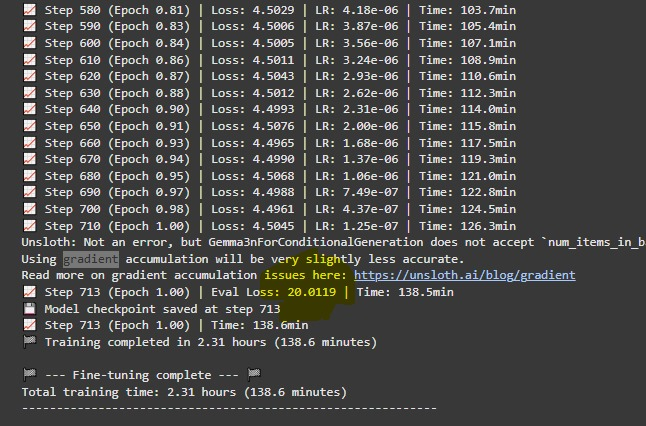
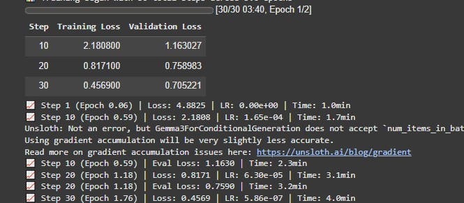

# FineTuneGemma: End-to-End Fine-Tuning Pipeline for Gemma on VizWiz

## Overview

This project provides a modular pipeline for preparing the [VizWiz dataset](https://vizwiz.cs.colorado.edu/VizWiz_final/) and fine-tuning vision-language models (such as Gemma) using Unsloth. The workflow is designed for easy use in Google Colab and supports robust configuration via a single [YAML file](fineTune/configs/configs.yaml).

---

## 1. Data Pipeline

The data pipeline is managed by the [`VizWizDataPipeline`](fineTune/data_pipeline/dataset_extraction.py) class, which automates:

- **Downloading**: Fetches VizWiz dataset components 
  
    - [annotations](https://vizwiz.cs.colorado.edu/VizWiz_final/caption/annotations.zip)
    - images, 
        - [Train](https://vizwiz.cs.colorado.edu/VizWiz_final/images/train.zip)
        - [Val](https://vizwiz.cs.colorado.edu/VizWiz_final/images/val.zip)
        - [Test](https://vizwiz.cs.colorado.edu/VizWiz_final/images/test.zip)
  
  from either a subset created by using [Script](create_subset_dataset.py) and uploaded to Google Drive manually or the original VizWiz URLs by changing settings in [`configs.yaml`](fineTune/configs/configs.yaml).

- Set `use_gdrive_urls: true` in [`configs.yaml`](fineTune/configs/configs.yaml) to choose which dataset to use. Since original dataset is quite big which takes couple of hours in extraction, applying transformations and if you are only training for 1 epoch it will further take 7 or more hours. Therefore, it is highly recommended that you use subset version of dataset.

- [**Extraction**:](fineTune/data_pipeline/dataset_extraction.py) Unzips and organizes the dataset into a structured directory. It also create respective `.jsonl` files for `annotation`, `train`, `val`, and `test` splits

- [**Transformation**](fineTune/data_pipeline/dataset_transformation.py) Converts raw data into a conversational format suitable for fine-tuning vision-language models and saved to disk.
- **Integrity Checking**: Verifies that the processed data matches expectations (e.g., no data loss during transformation).

- [Load Data:](fineTune/data_pipeline/dataset_loader.py) Loads transformed data for training.

You can control each step of the pipeline via the `preparation_steps` section in [`configs.yaml`](fineTune/configs/configs.yaml).

---

## 2. Configuration: `configs.yaml`

All settings are centralized in [`fineTune/configs/configs.yaml`](fineTune/configs/configs.yaml):

- **dataset.use_gdrive_urls**:  
  Set to `true` to use Google Drive links (recommended for Colab), or `false` for original VizWiz URLs.

- **dataset.urls**:  
  Contains both original and Google Drive URLs for all dataset components.

- **dataset.paths**:  
  Specifies where data will be stored and processed.  
  - `base_dir`, `temp_zip_dir`, `images_dir`, `annotations_dir`, `processed_dir`

- **dataset.preparation_steps**:  
  Flags to enable/disable each pipeline stage:
  - `run_prepare_step`: Download and extract raw data.
  - `run_transform_step`: Transform data for tuning.
  - `check_dataset_integrity`: Verify processed data.

- **dataset.subset**:  
  Enable to use only a percentage of the data for quick experiments.

- **fineTune**:  
  - `model_to_use`: The HuggingFace model ID to fine-tune.
  - `fourbit_models`: List of supported 4-bit models.
  - Output directories for adapters, checkpoints, logs, etc.
  - `export`: Settings for saving or pushing the final model to HuggingFace Hub.

- **tensorboard**:  
  - `auto_start`: Automatically launch TensorBoard in Colab.
  - `show_instructions`: Print setup instructions for TensorBoard.

**Example:**  
See the provided [`configs.yaml`](fineTune/configs/configs.yaml) for a complete, annotated example.

---

## 3. Useful Utilities

- [`make_clean_dir`](fineTune/utils/make_clean_dir.py):  
  Safely creates or resets directories.

- [`setupTensorboard`](fineTune/utils/colab_utils.py):  
  Automatically configures TensorBoard for Colab or prints manual setup instructions for local environments.

- [`DetailedLoggingCallback`](fineTune/utils/logging_callback.py):  
  Custom callback for enhanced logging during training.

- [`display_training_summary`](fineTune/utils/training_analyzer.py):  
  Summarizes training metrics after completion.

- [`get_gpu_usage_stats`](fineTune/utils/gpu_stats.py):  
  Reports GPU memory usage before and after training.

---

## 4. Running `FineTune.ipynb` in Google Colab

### **Step-by-Step Instructions**

#### **A. Prepare Your Environment**

1. **Upload Your Code and Dataset**
   - `git clone https://github.com/mm-mazhar/FineTuneGemma.git`
   - make necessary changes in `fineTune/configs/configs.yaml` if you wish to.
   - Zip `fineTune` folder, then
   - upload `fineTune.ipynb` to your Colab workspace and select GPU runtime with `A100 with High RAM` and run the notebook.

2. **Mount Google Drive**
   - The notebook will prompt you to mount your Google Drive for persistent storage.

3. **Unzip and Set Up Project**
   
   - In the next cell notebook will  prompt you to upload `fineTune.zip` (containing the codebase) to your Colab workspace.
   - The notebook extracts the code and adds it to the Python path.

4. **Install Dependencies**
   - All required packages are installed automatically, including Unsloth, PyTorch, and others.

5. **Configure Hugging Face Authentication**
   - Log in using your Hugging Face token (preferably stored in Colab `userdata`).

6. **Update `configs.yaml` for Colab**
   - The notebook automatically rewrites paths in `configs.yaml` to use Colab's local disk for fast I/O and Google Drive for persistent outputs.

#### **B. Run the Data Pipeline**

- The notebook runs [`prepare_data.py`](fineTune/prepare_data.py), which:
  - Downloads and extracts the dataset.
  - Transforms it for fine-tuning.
  - Optionally checks data integrity.

#### **C. Visualize the Data**

- Use the provided visualization cell to inspect individual dataset samples before training.

#### **D. Fine-Tune the Model**

- The notebook:
  - Loads the model and processor.
  - Configures LoRA adapters.
  - Loads the processed dataset.
  - Sets up training arguments and logging.
  - Starts training with real-time TensorBoard support.

#### **E. Save and Export**

- After training, the notebook:
  - Saves LoRA adapters and processor files.
  - Optionally pushes the merged model to the Hugging Face Hub.

---

## 5. Monitoring Training (Optional)

- **TensorBoard**:  
  - If `tensorboard.auto_start` is enabled and running in Colab, TensorBoard will launch automatically.
  - Otherwise, follow the printed instructions or run:
    ```
    python fineTune/monitor_training.py tensorboard
    ```
    to launch TensorBoard locally.

---

## 6. Analysis of Training Results

Previous attempts:

<div align="center">
  
</div>

You can see `eval loss` is quite high, then I made some changes in `SFTConfig` and also used Unsloth's `UnslothVisionDataCollator` instead of custom made `data_collator`.
Which has significant impact on `eval loss`.

<div align="center">
  
</div>


Training outcome is great, especially for a short, 30-step test run.
Here are the key takeaways:

#### **A. The Model is Learning Effectively:**

Training Loss shows a steep and consistent decrease, starting from a high of 4.8825 at Step 1 and dropping all the way to 0.4569 by Step 30. This is a classic sign of a model successfully learning the patterns in given data.


#### **B. The Model is Generalizing Well (Not Overfitting):**
This is the most important metric. Validation Loss is also consistently decreasing `(1.16 -> 0.75 -> 0.70)`. This means the model isn't just memorizing the training examples; it's learning the underlying task in a way that allows it to perform well on new, unseen data from the validation set.


#### **C. There is Room for More Improvement:**

The best sign here is that at the end of the 30 steps, validation loss was still going down. This strongly suggests that the model has not yet reached its peak performance. If you were to continue training for more steps or epochs, it's very likely the validation loss would decrease even further, resulting in a more accurate model.

#### **D. The Unsloth Message is Informational:**

The message Unsloth: `Not an error, but Gemma3ForConditionalGeneration` does not accept `num_items_in_batch`... is perfectly normal. It's a technical note from the library developers explaining that their optimization for gradient accumulation is slightly different for this specific model architecture. As they state, the effect on accuracy is negligible and you can safely ignore it.

#### **E. Conclusion and Next Steps:**

This is an ideal result for a test run. Successfully achieved:
  - Built a robust data pipeline.
  - Configured the trainer correctly.
  - Confirmed that the model can learn from given data effectively.

Clear next step is to perform a full training run. Based on these promising results, we should now go back to `SFTConfig` in `FineTune.ipynb` and make the following changes:

```
# num_train_epochs = 1, # Set this for a full training run
max_steps = 300,        # Or simply increase the number of steps
```

Training for more steps `(e.g., 300, 500, or a full epoch)` will allow the model to continue learning and will likely result in a significantly lower final validataion loss and a much more capable image captioning model.

---

## 7. Troubleshooting

- **Missing Dependencies**:  
  Ensure all requirements are installed. The notebook will print missing packages if any are detected.

- **Path Issues**:  
  Always run the notebook from the root directory where `fineTune.zip` is extracted.

- **Data Download Errors**:  
  Check your internet connection and verify that the URLs in `configs.yaml` are accessible.

---

## 8. References

- [VizWiz Dataset](https://vizwiz.cs.colorado.edu/)
- [Unsloth Documentation](https://github.com/unslothai/unsloth)
- [Hugging Face Hub](https://huggingface.co/)
- [FineTuning Gemma Model](https://huggingface.co/mazqoty/gemma-3n-vizWiz-finetuned)

---

## 9. Project Structure

```
fineTune/
    configs/
        configs.yaml
    data_pipeline/
        dataset_extraction.py
        dataset_transformation.py
        ...
    utils/
        colab_utils.py
        logging_callback.py
        ...
    prepare_data.py
    train.py
    visualize_data.py
    monitor_training.py
FineTune.ipynb
```

---
---